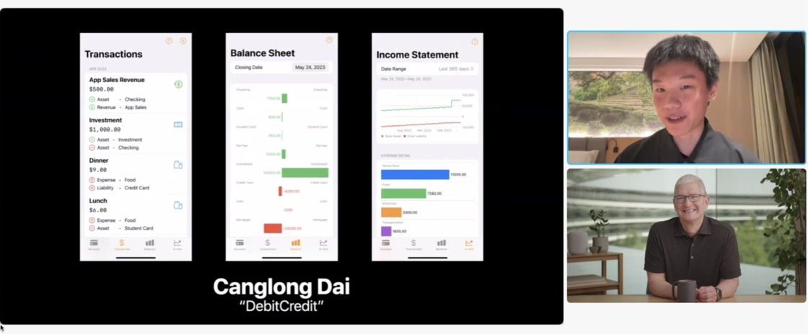

# DebitCredit

## Apple Swift Student Challenge 2023 Project (Accepted)

DebitCredit is a bookkeeping app based on the **Double-Entry Accounting** method, designed to help users learn and simplify this powerful financial tool so that everyone can use it to manage their finances without prior knowledge of accounting.

DebitCredit is **easy to use**, even for those without any accounting knowledge. In addition, we also aims to **educate** users about this powerful financial management tool.